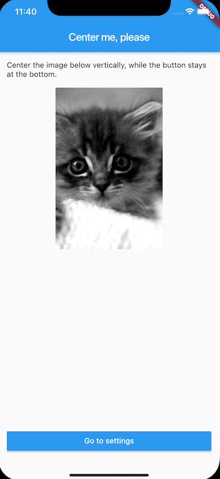
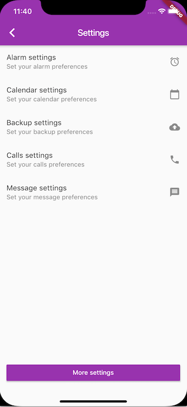
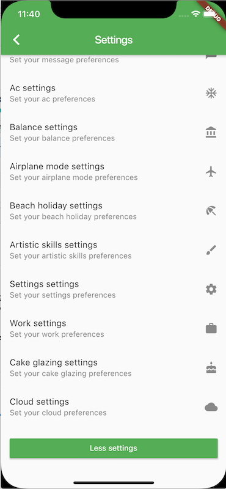

# layout_weirdness

Try to get this layout to work. Come on, I challenge you!

# Description

This is a fairly straightforward layout but very hard to nail down in Flutter. It shouldn't be this hard.

Basically, it's a footer that stays at the bottom of the screen, no matter if the content is enough to fill the view port or not. If the content is overflowing, the layout is scrollable. Kind of like `fill_viewport` in Android `ScrollView`. 

Also, I want to be able to have children that expand and center on the screen if there is empty space, while the footer stays put at the bottom.

